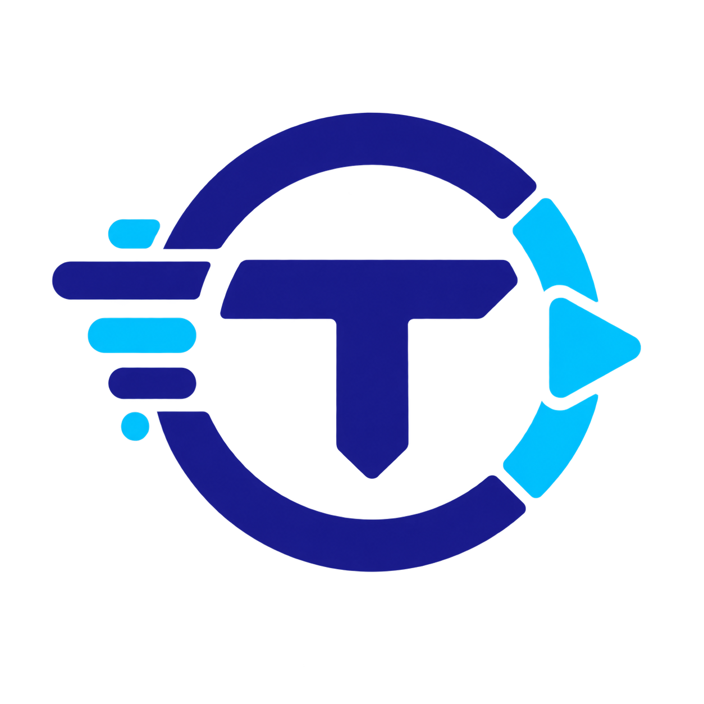
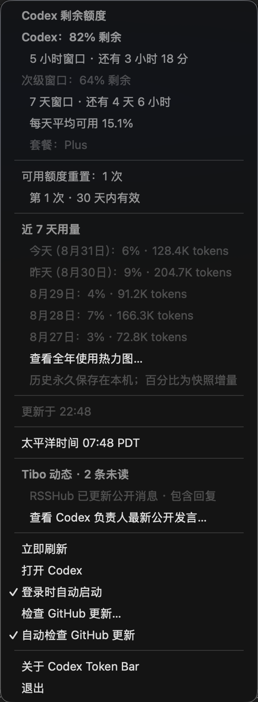

# Codex Token Bar

<p align="center">
  
</p>

一个原生桌面托盘小工具，在 macOS 菜单栏或 Windows 系统托盘直接显示 Codex 当前剩余额度，例如：

```text
23%
```

<p align="center">
  
</p>

点击后可查看每个 Codex 额度桶的剩余百分比、窗口长度、距离重置的天数与小时数、每天平均可用百分比、具体重置时间、套餐，以及每次可用额度重置的有效期。

菜单栏百分比支持两个入口：左键打开完整额度下拉菜单；右键（或 `Control` 加左键）直接打开“Tibo 动态”窗口。

当本机 RSSHub 或 X 页面发现新的 Tibo 消息时，菜单栏会在额度百分比旁显示 X 未读数，例如 `82%  X3`。第一次升级会把现有缓存作为已读基线，不会突然出现一批历史未读。右键打开 Tibo 资讯窗口会将当前缓存全部标为已读；从下拉菜单单独打开一条原帖时，只标记该条。没有未读时只显示额度百分比。

下拉菜单还会显示当前太平洋时间，并提供一个北京时间与太平洋时间之间的双向换算工具。太平洋时区使用 `America/Los_Angeles`，会自动处理夏令时（PDT）与标准时间（PST）。

“Tibo 动态”可在 App 内打开 Codex 负责人 Thibault “Tibo” Sottiaux（[@thsottiaux](https://x.com/thsottiaux)）的 X 页面，也可以在同一窗口查看他在不同帖子下的公开回复。该功能不需要 X API Key；免费公开来源可能遗漏部分回复，App 会明确提示，不会把它标成完整采集结果。若 X 要求登录，App 会显示 X 自己的登录页面，也可以改用系统浏览器打开并沿用浏览器中的登录状态。

内置 X 登录页支持标准的 `Command-C`、`Command-V`、`Command-X` 与 `Command-A` 编辑快捷键。X 的 Cookie 和登录状态由 macOS WebKit 存储，以便 App 重启后继续登录；Codex Token Bar 不读取或保存输入的 X 账号、密码。

Tibo 资讯卡片支持按条“翻译成中文”、批量翻译全部未翻译消息，以及“自动翻译新消息”。自动翻译默认开启，但第一次发送前仍会要求用户确认；拒绝后会同时关闭自动翻译。启用自动翻译或主动翻译时，相关公开帖子正文会发送给 MyMemory 免费翻译接口，译文缓存在本机。匿名使用无需 API Key，当前公开额度约为每天 5,000 字符。接口每次最多接收 500 字节，App 会自动安全分段并依次请求，避免同时发起大量请求。也可以继续在“X 原页”使用 X 自己的“翻译帖子”。

打开并登录 Tibo 时间线后，App 会从当前已经加载的页面中读取少量 `@thsottiaux` 公开帖子，在菜单里显示最近 4 条并链接到原帖。本机最多缓存 20 条用于下次启动时继续显示；不会读取私信、密码或其他账号页面，也不会在后台连续滚动抓取。

右键打开的“Tibo 消息”顶部可在“RSS”“资讯”和“X 原页”之间切换，并把 RSS 设为第一个标签和每次打开窗口时的默认页。RSS 页只显示本机 RSSHub 最近一次返回的消息，并明确标注是否包含回复；RSS 来源会随本机缓存保存，重启后仍可查看。RSS 与资讯卡片有译文时优先显示中文机翻，英文原文默认折叠，可按条展开或再次收起；尚无译文时仍直接显示原文，避免出现空白卡片。正文和译文都可以选择复制。只有从 X 补充消息、查看回复或使用 X 原生翻译时才需要进入原页。

消息窗口使用接近黄金比例的 Fibonacci 间距系统（5、8、13、21、34 点）组织标题、来源工具、翻译工具、正文和卡片留白。正文采用更舒展的行高，中文机翻字号略高于折叠后的英文原文；卡片边界、圆角和操作区保持统一节奏，在提升信息密度的同时避免按钮与正文挤在一起。

X 时间线有时只提供长帖的截断摘要。每次从已经打开的 X 页面读取消息前，App 会先在 Tibo 帖子中查找并自动点击“Show more / 显示更多”，等待正文展开后再保存。识别范围包含标准链接、按钮、链接角色、按钮角色，以及 X 使用普通 `span` / `div` 包装的蓝色“显示更多”文字。行内展开按钮可以逐一处理；如果按钮实际会跳转原帖，则一次只点击一个，避免连续跳转扰乱页面。App 也会识别旧缓存中接近 280 字符的可疑正文，并在卡片上保留“补全全文”。用户点击后，App 只使用当前已登录的 X 会话重新读取这一条原帖；若获得更长正文，会替换旧摘要并让自动翻译重新生成对应译文。较短的新结果不会覆盖本机已有的较长正文。

App 会优先使用本机按需启动的 RSSHub 读取 Tibo 完整时间线。RSSHub 直接沿用内置 X 页面的 `auth_token` Cookie；Cookie 仅通过标准输入交给一次性本机进程，不写入配置文件、不出现在进程参数中，也不会上传公共 RSSHub 或 Folo 实例。默认每 30 分钟更新一次，更新完成后 Node 进程退出。主帖与“主帖＋回复”两个来源分别请求；回复来源暂时失效时，主帖仍会正常更新，并在菜单中明确显示降级状态。网页读取和“补全全文”继续作为备用方案。

下拉菜单还会列出最近 7 个自然日每天消耗的主 Codex 额度百分比，以及官方按天统计的 token 数量，并可打开最近 52 周的日历热力图。首次启用或从旧版升级时，App 会扫描当前仍保留的本机 Codex 会话，尽量回填已有额度快照；之后每分钟记录当前额度。历史样本会一直保留，不再自动删除，文件保存在本机 `~/Library/Application Support/Codex Token Bar/usage-history.json`。

## 它显示的是什么

顶部百分比来自 Codex 官方本地 App Server 的 `account/rateLimits/read`，计算方式是：

```text
剩余百分比 = 100 - usedPercent
```

优先显示主 `codex` 额度；Spark 等独立额度会列在下拉菜单中。这是账号的实际 Codex 用量额度，不是某一个对话的上下文窗口。

一天以上的额度窗口还会给出均匀使用建议：

```text
每天平均可用百分比 = 剩余百分比 ÷ 距重置的精确天数
```

不足一天的长周期额度会直接显示本周期尚可使用的余额；短于一天的额度窗口不计算日均值。

## Windows 版本

Windows 版支持 Windows 10/11 x64，使用原生系统托盘界面，并提供：

- 托盘图标直接显示主 Codex 剩余额度；
- 主额度与其他额度桶的剩余百分比、窗口长度、重置倒计时和套餐信息；
- 与 macOS 相同顺序的额度重置、近 7 天快照增量、官方每日 tokens、太平洋时间与 Spark 折叠菜单；
- 北京时间与太平洋时间双向换算、全年使用热力图和 GitHub 更新检查；
- 每 60 秒自动刷新，以及手动刷新；
- 首次运行默认开启登录 Windows 时自动启动，也可从托盘菜单关闭；
- Codex 断线后自动重新连接。

从 [GitHub Releases](https://github.com/Kymorphius/codex-token-bar/releases/latest) 下载时可选择：

- `CodexTokenBar-Windows-x64-Setup.exe`：安装版，推荐大多数用户使用；
- `CodexTokenBar-Windows-x64-Portable.exe`：便携版（Portable），无需安装，但由于包含完整运行环境，文件会明显更大。

使用前请先按照 [Codex CLI 官方说明](https://developers.openai.com/codex/cli/) 安装并登录 Codex。Windows 版会自动查找 `PATH`、npm 全局安装目录和 Codex/ChatGPT 桌面应用内的 `codex.exe`；也可以通过 `CODEX_TOKEN_BAR_CODEX_PATH` 指定路径。

Windows 版保留 Tibo 菜单位置、X 时间线与回复入口，并通过独立的 WebView2 用户数据目录支持内嵌 X 登录和登录 Cookie 自动检测。检测到登录后会按需安装并运行一次性本机 RSSHub，最近 20 条公开消息缓存在本机，最近 4 条直接显示在托盘菜单中。应用不读取输入的账号或密码，检测到的 `auth_token` 不显示、不写日志、不以明文保存；为了让登录自启动后能够自动刷新，它会额外使用 Windows 当前用户的数据保护功能加密保存，其他 Windows 用户不能解密。

Windows 内置 X 页面默认跟随 Windows 显示语言，也可以在窗口顶部手动选择简体中文、繁体中文、英语、日语、韩语、法语、德语或西班牙语。选择会保存，并同时应用到 WebView2、X 的语言 Cookie 和页面地址；旁边的“X 翻译设置”可直接打开 X 自己的语言与翻译设置页。

### Windows 开发者构建

需要 Windows 10/11 和 .NET 8 SDK。在 PowerShell 中运行：

```powershell
.\scripts\build_windows.ps1
```

生成的免安装单文件位于 `dist\windows-x64\CodexTokenBar.exe`，发布到 GitHub 时会命名为 `CodexTokenBar-Windows-x64-Portable.exe`。正式构建会先运行一次 Twitter 用户路由并记录实际加载模块，只保留该模块集合及其依赖闭包，再将便携 Node 和精简 RSSHub 压缩进单文件。用户首次运行时只在本机解压，不需要系统预装 Node/npm，也不需要联网安装 RSSHub；开发时可传入 `-SkipBundledRssHub` 跳过内置组件。如果已安装 Inno Setup，同一脚本还会生成 `dist\CodexTokenBar-Windows-x64-Setup.exe`。仓库中的 Windows GitHub Actions 工作流也会在每次推送和拉取请求时构建可下载的 EXE artifact。

## macOS 安装并启动

需要 macOS 13 或更新版本，并已安装且登录 Codex/ChatGPT 桌面应用。macOS 版与 Windows 版一样自带 Tibo 动态所需的 Node.js 和精简 RSSHub，用户不需要另外安装 Node/npm，也不会在首次使用时联网安装运行组件。

1. 从 [GitHub Releases](https://github.com/Kymorphius/codex-token-bar/releases/latest) 下载最新的 `.dmg`。
2. 双击打开 DMG。
3. 按照窗口中的箭头，把 `Codex Token Bar.app` 拖到“应用程序”文件夹。
4. 从“应用程序”文件夹启动 Codex Token Bar。

如果 macOS 首次启动时提示无法验证开发者，请在 Finder 中按住 `Control` 点击 App、选择“打开”，再确认一次。安装完成后可在菜单里打开“登录时自动启动”。整个安装过程不需要命令行。

菜单中的“检查 GitHub 更新…”会读取项目最新的 GitHub Release，并与当前 App 版本比较。发现新版本后优先下载 DMG；如果没有 DMG，才使用 ZIP 或打开对应的发布页面。用户也可以开启“自动检查 GitHub 更新”：该设置默认关闭，开启后会在 App 启动时检查，并每 24 小时检查一次；同一版本只主动提示一次。检查更新不需要 GitHub Token，也不会在未经确认时安装或替换 App。

如果菜单栏图标很多，macOS 可能会因为空间不足临时隐藏新项目。此时先在对应应用或系统设置里隐藏一个不需要的菜单栏项目；部分系统图标也可以按住 `Command` 拖走。腾出空间后，百分比会自动出现。

## macOS 开发者构建

构建 App：

```bash
./scripts/build_app.sh
open "dist/Codex Token Bar.app"
```

正式构建默认把当前架构的 Node.js 与精简 RSSHub 一并放入 App，因此开发机需要 Node.js/npm。只调试不使用 Tibo RSS 功能时，可以跳过内置组件以缩短构建时间：

```bash
./scripts/build_app.sh debug --skip-bundled-rsshub
```

生成带拖拽安装界面的 DMG：

```bash
./scripts/build_dmg.sh
```

DMG 中包含 `Codex Token Bar.app`、指向系统 `/Applications` 的“应用程序”文件夹快捷方式，以及引导用户将 App 拖入该文件夹的背景箭头。

## 隐私与刷新

- 不读取、复制或保存 `auth.json`，也不需要额外 API Key。
- 通过本机 Codex CLI 使用现有登录状态读取额度。
- 近 7 天百分比按本机额度快照的正向增量统计；跨设备、云端或缺少快照的时段可能无法准确分配到某一天，菜单会标注为“本机统计”。
- 每日 token 数来自 Codex 官方 `account/usage/read` 日桶；当天日桶可能延迟返回，此时显示“待官方更新”，而不是误显示为 0。
- 每 60 秒刷新一次；Codex 主动通知额度变化时也会刷新。
- 所有数据显示都留在本机。
- 用量历史不会自动过期；删除 App 不会自动删除位于 Application Support 中的历史文件。
- Tibo 时间线只在用户打开窗口时加载，关闭窗口后不会在后台轮询，因此不会持续增加网络或电量消耗。
- 用户主动检查更新或自行开启“自动检查 GitHub 更新”后，App 才会访问 GitHub Releases API。

## 找不到 Codex 时

App 会依次查找 ChatGPT/Codex 应用内置的 CLI、Homebrew 路径和当前 `PATH`。也可以指定路径后从终端启动：

```bash
CODEX_TOKEN_BAR_CODEX_PATH=/完整路径/codex open "dist/Codex Token Bar.app"
```
